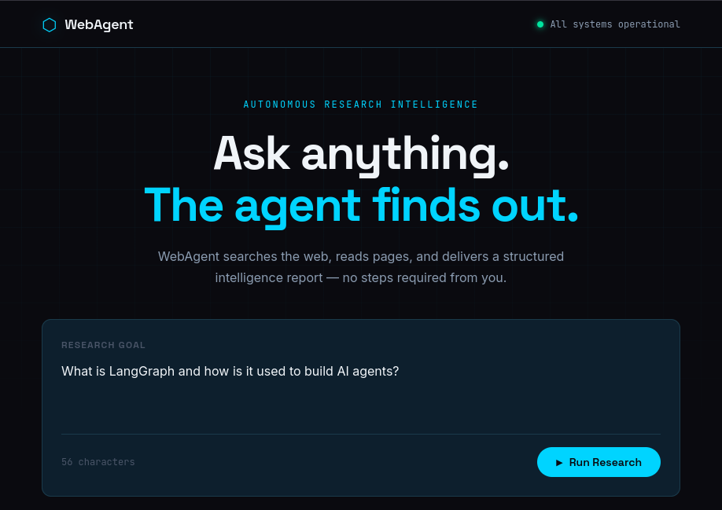
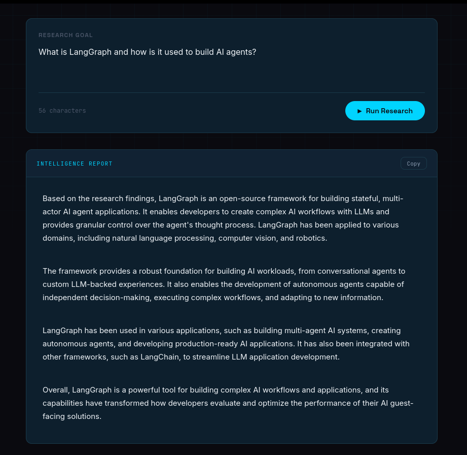
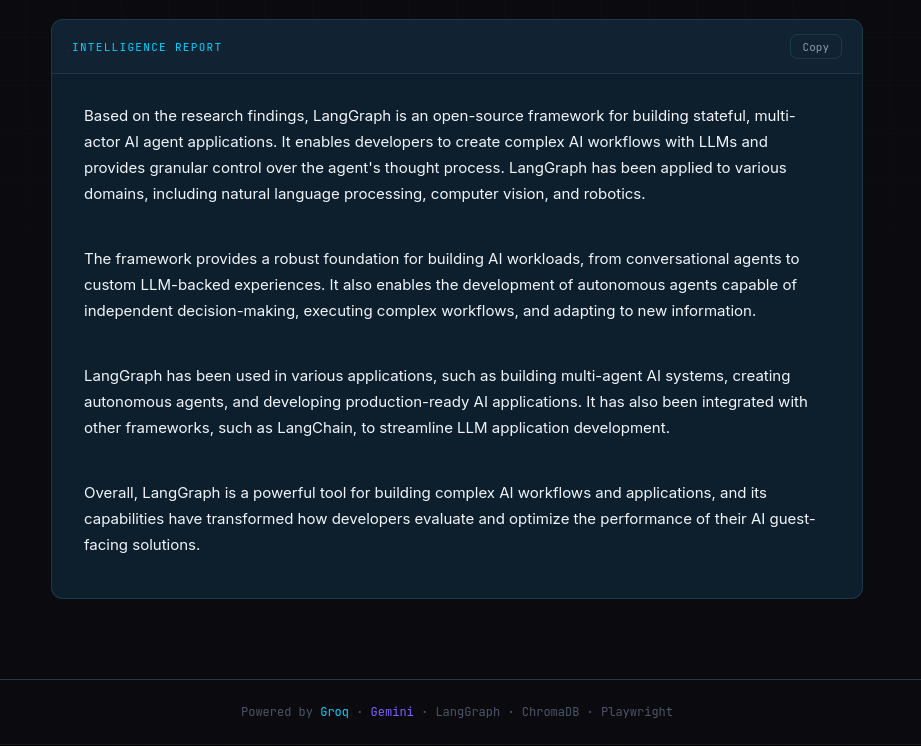

# WebAgent_AUTONOMOUS_WEB_RESEARCH_INTELLIGENCE_AGENT

A self-directed research agent that takes a natural language goal, searches the web, reads pages, stores findings, and delivers a structured intelligence report — without any manual steps from the user.

Built with LangGraph, Groq, Gemini, Playwright, ChromaDB, and Flask.

---

## App in Action







---

## What it does

You type a research goal. The agent decides everything else.

It searches DuckDuckGo for relevant pages, fetches and extracts content using a headless Chromium browser, stores findings as vector embeddings in ChromaDB, evaluates whether it has enough information, searches again if needed, and finally generates a structured intelligence report with four sections: Summary, Key Findings, Sources, and Gaps.

The report streams back to the browser in real time — you watch it appear word by word rather than waiting for a single response.

---

## Repository Structure

```
WebAgent_AUTONOMOUS_WEB_RESEARCH_INTELLIGENCE_AGENT (repo root)
├── WebAgent/                    ← project directory
│   ├── agent/
│   │   ├── __init__.py
│   │   ├── llm.py               # Groq (primary) + Gemini (fallback) LLM config
│   │   ├── memory.py            # ChromaDB vector store for research findings
│   │   ├── tools.py             # Four agent tools: search, fetch, store, report
│   │   └── agent.py             # LangGraph ReAct loop orchestration
│   ├── scraper/
│   │   ├── __init__.py
│   │   └── playwright_fetch.py  # Headless Chromium page fetcher + text extractor
│   ├── app/
│   │   ├── __init__.py
│   │   ├── app.py               # Flask backend with SSE streaming
│   │   ├── templates/
│   │   │   └── index.html       # Frontend UI
│   │   └── static/
│   │       ├── style.css        # Deep space visual design
│   │       └── main.js          # SSE client + UI state machine
│   └── requirements.txt
├── images/                      ← screenshots for this README
├── README.md
└── LICENSE
```

**Agent loop (LangGraph ReAct pattern):**

```
Goal → web_search → fetch_page → store_finding → evaluate
          ↑                                          |
          └──────────── search again if needed ──────┘
                                                     |
                                              generate_report
```

---

## Tech stack

| Layer | Technology |
|---|---|
| Agent framework | LangGraph `create_react_agent` |
| Primary LLM | Groq — `llama-3.1-8b-instant` |
| Fallback LLM | Gemini — `gemini-2.5-flash-lite` |
| Web search | `ddgs` (DuckDuckGo, no API key) |
| Page fetching | Playwright (headless Chromium) |
| Text extraction | BeautifulSoup + lxml |
| Vector store | ChromaDB (local, persistent) |
| Embeddings | `sentence-transformers/all-MiniLM-L6-v2` (CPU) |
| Backend | Flask with SSE streaming |
| Frontend | HTML + CSS + Vanilla JS |

All LLM computation runs on cloud APIs. No local LLM. No GPU required.

---

## Design decisions

**Groq as primary LLM.** Groq drives the entire agent loop — all tool call decisions, search query planning, content evaluation, and iteration logic. The free tier provides 14,400 requests/day with no credit card required. `llama-3.1-8b-instant` is fast enough for an interactive research loop.

**Gemini as fallback for report generation.** Gemini `gemini-2.5-flash-lite` is configured as fallback specifically for the `generate_report` tool call — the final step where all stored findings are sent to the LLM to produce the structured report. If Groq fails at that step, Gemini takes over automatically via `invoke_with_fallback` in `llm.py`. The rest of the agent loop runs on Groq.

**sentence-transformers for embeddings.** Runs locally on CPU — no embedding API, no cost, no rate limits. `all-MiniLM-L6-v2` handles the embedding load of a research session comfortably on an i5.

**Sequential Playwright fetching.** Pages are fetched one at a time, not in parallel. This keeps CPU and memory pressure low on modest hardware.

**SSE streaming over WebSockets.** Server-Sent Events are unidirectional and require no persistent connection management — the right tool for a one-way stream of agent output to a browser.

**Class-based architecture.** Every module (`LanguageModelManager`, `ResearchMemory`, `AgentTools`, `ResearchAgent`, `WebAgentApp`) is a self-contained class with a clear `__init__`, named methods, and a `run()` entry point. No decorators except where unavoidable.

---

## Setup

**Prerequisites:** Python 3.10+, Groq and Gemini API keys (both free, no credit card).

- Groq key: [console.groq.com](https://console.groq.com)
- Gemini key: [aistudio.google.com](https://aistudio.google.com)

**Clone the repository:**

```bash
git clone https://github.com/SHAIMOOM251283/WebAgent_AUTONOMOUS_WEB_RESEARCH_INTELLIGENCE_AGENT.git
cd WebAgent_AUTONOMOUS_WEB_RESEARCH_INTELLIGENCE_AGENT
```

**Create a virtual environment:**

```bash
python -m venv ~/venvs/webagent-env
source ~/venvs/webagent-env/bin/activate
# Windows: ~/venvs/webagent-env/Scripts/activate
```

**Install dependencies:**

```bash
cd WebAgent
pip install -r requirements.txt
playwright install chromium
```

**Add your API keys** to `agent/llm.py`:

```python
GROQ_API_KEY   = "your_groq_api_key_here"
GEMINI_API_KEY = "your_gemini_api_key_here"
```

**Run the app:**

```bash
python app/app.py
```

Open `http://localhost:5000` in your browser.

---

## Running the self-tests

Each module has a built-in self-test. Run them in dependency order from inside the `WebAgent/` directory to verify each layer before launching the full app:

```bash
cd WebAgent
python -m agent.memory              # ChromaDB + embeddings
python scraper/playwright_fetch.py  # Playwright page fetching
python -m agent.llm                 # Groq + Gemini health check
python -m agent.tools               # All four tools end to end
python -m agent.agent               # Full agent loop
python app/app.py                   # Full application
```

---

## How the report is structured

Every research session produces a four-section markdown report:

**Summary** — 2–3 sentence overview of what the research found.

**Key Findings** — numbered list of the most important insights.

**Sources** — all URLs referenced during the research session.

**Gaps** — what the research could not conclusively answer and what further investigation might address.

---

## Known limitations

- Groq's free tier has a 6,000 tokens-per-minute (TPM) limit. The agent makes multiple LLM calls per session, each carrying the accumulated conversation history. Allow approximately 60 seconds between research sessions to stay within this limit.
- Page content is truncated to 500 characters per page to keep the token count within Groq's free tier TPM limit. This keeps the agent loop reliable but limits report depth. Upgrading to Groq's Developer tier removes this constraint.
- Gemini's free tier has a 20 requests-per-day limit on `gemini-2.5-flash-lite`, making it unsuitable as a primary LLM for multi-step agent loops. It serves reliably as a fallback for the final report generation step.
- Pages behind login walls or heavy bot-detection cannot be fetched by Playwright.
- Report quality depends on how much extractable text the fetched pages contain. Heavily JavaScript-rendered single-page apps may yield little content.

---

## Author

**Shaimoom Shahriar**

Self-taught AI & Data Developer

[GitHub](https://github.com/SHAIMOOM251283)

[LinkedIn](https://www.linkedin.com/in/shaimoom-shahriar-18a1a0330/)

[Upwork](https://www.upwork.com/freelancers/~0187163401c731d145)